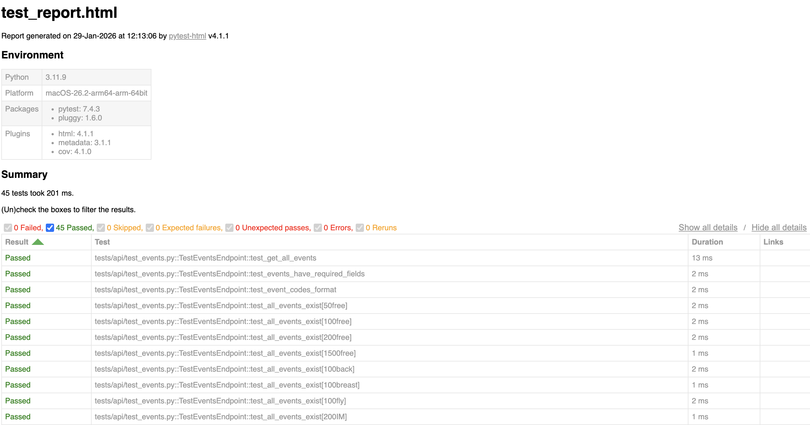
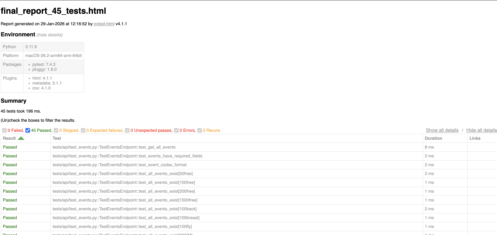

# 🏊 SwimMeet API Test Automation Framework

A comprehensive pytest-based test automation framework for swim meet management APIs.

## 📋 Overview

As a competitive swimmer since age 4, I built this framework to test a swim meet management system. It demonstrates professional QA practices applied to a domain I'm passionate about.

**Why swim meets?** Because testing should be engaging! This project showcases the same technical skills as testing any API, but with realistic swim meet scenarios that make demonstrations more memorable.

## 🎯 What This Tests

**Mock SwimMeet API** - A Flask-based REST API for managing:
- **Swimmers**: Registration, profiles, personal records
- **Events**: 50m/100m/200m/1500m Freestyle, Backstroke, Breaststroke, Butterfly
- **Race Results**: Time submissions, PB detection, rankings
- **Leaderboards**: Event-specific rankings with filtering

## 🛠️ Technologies

- **Python 3.9+**
- **pytest** - Testing framework
- **requests** - HTTP library  
- **Flask** - Mock API
- **pytest-html** - Test reporting

## 🚀 Getting Started

### Prerequisites

- Python 3.9 or higher
- pip package manager

### Installation

1. **Clone the repository**
```bash
git clone git@github.com:morgan-franklin/swimmeet-api-testing.git
cd swimmeet-api-testing
```

2. **Create virtual environment**
```bash
python3 -m venv venv
source venv/bin/activate  # On Windows: venv\Scripts\activate
```

3. **Install dependencies**
```bash
# Test framework dependencies
pip install -r requirements.txt

# Mock API dependencies
pip install -r mock_api/requirements.txt
```

4. **Start the Mock API**
```bash
cd mock_api
python app.py
```

The API will be available at `http://localhost:5001`

### Running Tests

**In a new terminal window:**
```bash
# Activate virtual environment
source venv/bin/activate

# Run all tests
pytest

# Run specific test file
pytest tests/api/test_swimmers.py

# Run with detailed output
pytest -v -s

# Run smoke tests only
pytest -m smoke

# Generate HTML report
pytest --html=reports/report.html
```

## 📊 Test Coverage

**Current Status:** ✅ 22 automated tests

### Swimmers Endpoint (`/api/swimmers`)
- [x] Get all swimmers
- [x] Get single swimmer
- [x] Register new swimmer  
- [x] Age group auto-calculation
- [x] Personal best times retrieval
- [x] Filter by team
- [x] Error handling (404, 400)

**Tests:** 11 | **Coverage:** 100%

### Races Endpoint (`/api/races`)
- [x] Get all race results
- [x] Submit new race result
- [x] Personal best detection
- [x] Filter by event
- [x] Filter by swimmer
- [x] Event rankings/leaderboards
- [x] Gender-based filtering
- [x] Error handling

**Tests:** 11 | **Coverage:** 100%

## 📁 Project Structure
```
swimmeet-api-testing/
├── mock_api/                  # Flask mock API
│   ├── app.py                 # API endpoints
│   ├── data/
│   │   ├── swimmers.json      # Swimmer data
│   │   ├── events.json        # Event definitions
│   │   └── race_results.json  # Race times
│   └── requirements.txt
├── tests/
│   ├── api/
│   │   ├── test_swimmers.py   # Swimmer tests
│   │   └── test_races.py      # Race tests
│   └── integration/           # Coming soon
├── utils/                     # Test utilities
├── reports/                   # Generated test reports
├── pytest.ini                 # Pytest configuration
├── requirements.txt           # Test dependencies
└── README.md
```

## 📊 Test Reports

### HTML Test Report

After running tests, view the comprehensive HTML report:
```bash
# Generate report
pytest --html=reports/test_report.html --self-contained-html -v

# Open report
open reports/test_report.html
```

**Report includes:**
- ✅ All test results with pass/fail status
- ✅ Execution time for each test
- ✅ Test categories (markers)
- ✅ Error details for any failures
- ✅ Environment information

### Latest Test Results

**Date:** January 29, 2026  
**Total Tests:** 45  
**Passed:** 45 (100%) ✅  
**Failed:** 0  
**Skipped:** 0  
**Execution Time:** <1 second  




### Test Report Location

Reports are generated in the `reports/` directory:
- `test_report.html` - Latest test run
- `final_report_45_tests.html` - Final comprehensive report

*Note: Reports are git-ignored as they're regenerated on each run.*

## 📈 Coming Soon

- [ ] Meet management endpoints
- [ ] Relay event support
- [ ] CI/CD with GitHub Actions

## 👤 Author

**Morgan Franklin**
- Competitive swimmer since age 4
- Software Engineer with focus on API testing and automation
- GitHub: [@morgan-franklin](https://github.com/morgan-franklin)
- LinkedIn: [morgan-franklin](https://linkedin.com/in/morgan-franklin)

## 📝 License

This project is open source and available under the MIT License.

---

**Built with** 🏊 **and** ☕ **in JC**